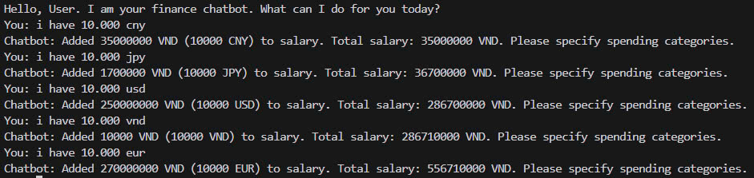
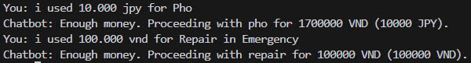
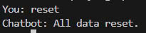
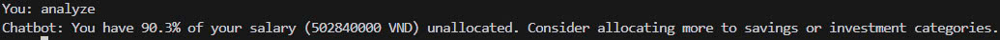
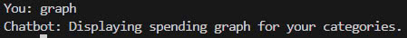
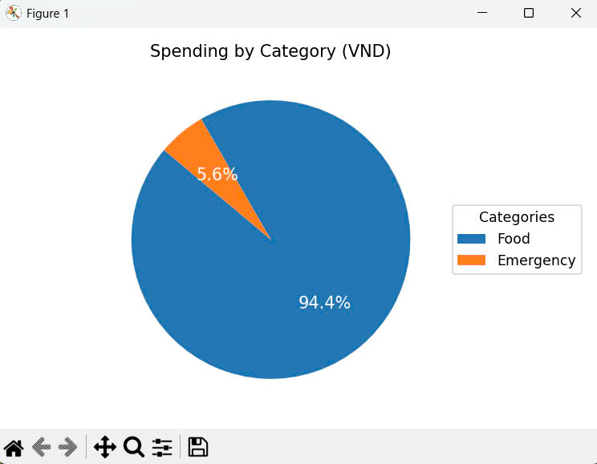
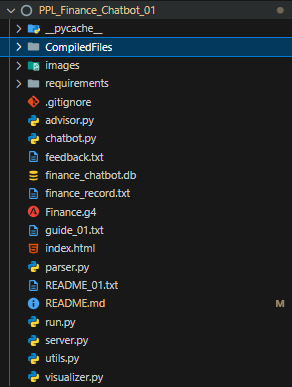

# International University  
**Vietnam National University - Ho Chi Minh City**  

## 📘 Course: Principles of Programming Languages  
**Project Title:** Finance Chatbot  

---

## 👥 Team Members
| Name               | Student ID     | Role     |
|--------------------|----------------|----------|
| Nguyễn Anh Trí     | ITCSIU22152    | Team Leader |
| Hà Minh Trí        | ITCSIU22194    | Developer |
| Đỗ Hùng Việt       | ITCSIU22197    | Developer |
| Phan Đức Trí       | ITCSIU22151    | Developer |

---

## 📂 Repository Purpose
This repository implements a **Finance Chatbot** that uses **ANTLR4** for grammar parsing and **Python** for handling user interactions, currency conversion, spending analysis, and visualization.

**Responsibilities:**
- Nguyễn Anh Trí - ITCSIU22152
- Hà Minh Trí – ITCSIU22194  
- Đỗ Hùng Việt – ITCSIU22197
- Phan Đức Trí - ITCSIU22151

---

## 💬 Chatbot Command Reference

The chatbot supports the following commands and logs actions in `finance_record.txt`.  
Each section includes a **command syntax** and a **sample screenshot** from the `/image` folder.

### 1. 💵 Input Salary (with currency)
**Command Examples:**
```bash
i have 10.000 vnd
i have 10.000 usd
i have 10.000 eur
i have 10.000 jpy
i have 10.000 cny
```
**Sample:**  


---

### 2. 🗂️ Create Spending Categories
**Command Example:**
```bash
i want to have 1.000 USD for Renting, 1.000 CNY for Food, 1.000 EUR for Clothes, 1.000 JPY for Emergency
```
**Sample:**  


---

### 3. 💸 Record Spending
**Command Examples:**
```bash
i used 10.000 jpy for Pho
i used 100.000 vnd for Repair in Emergency
```
**Sample:**  


---

### 4. 🔄 Change Category Allocation
**Command Example:**
```bash
change the money for Food to 1.000 eur
```
**Sample:**  


---

### 5. ❌ Delete Category
**Command Example:**
```bash
delete Clothes
```
**Sample:**  


---

### 6. 🔃 Reset All Data
**Command:**
```bash
reset
```
**Sample:**  


---

### 7. 📊 Analyze Spending
**Command:**
```bash
analyzing
```
**Sample:**  


---

### 8. 📈 Show Graph
**Command:**
```bash
graph
```
**Sample:**  



---

### 9. 🚪 Exit Program
**Command:**
```bash
exit
```
**Sample:**  


---

## 🛠️ How to Run

### 1. Requirements
- Python 3.12.10  
- ANTLR4 4.9.2  
- SQLite
- Java JDK
- Files in the `requirements` folder

### 2. Create a folder named CompiledFiles


### 2. Clone the Project
```bash
git clone https://github.com/tuilatri/PPL_Finance_Chatbot_01.git
```

### 3. Create Virtual Environment
```bash
<path_to_python>\python.exe -m venv venv
```

### 4. Activate Environment
```bash
.\venv\Scripts\Activate.ps1

```

### 5. Add Hugging Face Token
- Get your token via: [Hugging Face](https://huggingface.co/settings/tokens)


```bash
$Env:HF_TOKEN = "HF_TOKEN" (replace HF_TOKEN with yours)
deactivate
.\venv\Scripts\Activate.ps1
echo $Env:HF_TOKEN


```

### 6. Install Dependencies
```bash
python -m pip install spacy==3.8.2 antlr4-python3-runtime==4.9.2 flask huggingface_hub
python -m spacy download en_core_web_sm
python -m pip install matplotlib

```

### 7. Verify Installation
```bash
python -m pip list

```

### 8. Generate the antlr4 (if not)
```bash
python run.py gen

```

### 9. Run the program
```bash
python server.py

```

---

## 🧠 Features
**Natural Language Parsing:**
Parses commands like i have 10.000 usd or i used 100.000 vnd for coffee using ANTLR (Finance.g4).

**Multi-Currency Support:**
Converts currencies (VND, USD, EUR, JPY, CNY) using fixed rates. Original values are kept in finance_record.txt.

**User-Friendly Commands:**
Allows intuitive interactions for salary input, budgeting, spending, resetting, and analysis.

**Data Visualization:**
Displays a pie chart (via matplotlib) showing spending distribution with percentages.

**Financial Analysis:**
Uses NLP (via spaCy) to analyze user data and provide advice on overspending or budgeting gaps.

**Persistent Logs:**
All actions are saved in finance_record.txt with formatted entries for continued use.
